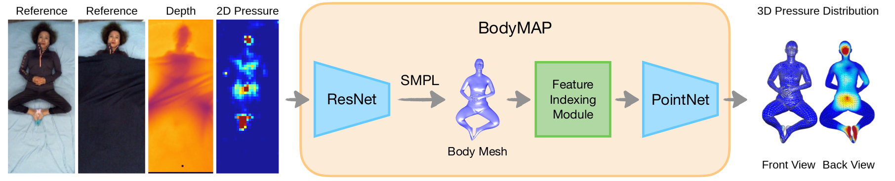

# BodyMAP


BodyMAP leverages a depth and pressure image of a person in bed covered by blankets to jointly predict the body mesh (3D pose & shape) and a 3D pressure map of pressure distributed along the human body.

<p align="center">

</p> 

## Trained Models 

The trained BodyMAP-PointNet model and BodyMAP-Conv models are available for research purposes. ([Link](Drive link to models))

## Data Setup 

1. Follow instructions from [BodyPressure](https://github.com/Healthcare-Robotics/BodyPressure?tab=readme-ov-file#download-data) to download and setup SLP dataset and BodyPressureSD dataset. 

2. Download and extract the 3D pressure maps for the two datasets. ([Link](Public drive link: TODO))

3. Download SMPL human models. ([Link](https://smpl.is.tue.mpg.de/en)). Place the models (SMPL_MALE.pkl and SMPL_FEAMLE.pkl) in ```BodyMAP/smpl_models``` directory.

4. Change BASE_PATH constant in [constants.py](https://github.com/RCHI-Lab/BodyMAP/blob/main/PMM/constants.py#L43) based on your file structrure. The BASE_PATH folder should look like:

    ```
    BodyPressure
    ├── data_BP
    │   ├── SLP
    │   │   └── danaLab
    │   │       ├── 00001
    │   │       .
    │   │       └── 00102
    │   │   
    │   ├── slp_real_cleaned
    │   │   ├── depth_uncover_cleaned_0to102.npy
    │   │   ├── depth_cover1_cleaned_0to102.npy
    │   │   ├── depth_cover2_cleaned_0to102.npy
    │   │   ├── depth_onlyhuman_0to102.npy
    │   │   ├── O_T_slp_0to102.npy
    │   │   ├── slp_T_cam_0to102.npy
    │   │   ├── pressure_recon_Pplus_gt_0to102.npy
    │   │   └── pressure_recon_C_Pplus_gt_0to102.npy
    │   │   
    │   ├── SLP_SMPL_fits
    │   │   └── fits
    │   │       ├── p001
    │   │       .
    │   │       └── p102
    │   │   
    │   ├── synth
    │   │   ├── train_slp_lay_f_1to40_8549.p
    │   │   .
    │   │   └── train_slp_rside_m_71to80_1939.p
    │   │   
    │   ├── synth_depth
    │   │   ├── train_slp_lay_f_1to40_8549_depthims.p
    │   │   .
    │   │   └── train_slp_rside_m_71to80_1939_depthims.p
    │   │   
    │   └── GT_BP_DATA
    |   |   ├── bp2
    |   |       ├── train_slp_lay_f_1to40_8549_gt_pmaps.npy
    |   |       ├── train_slp_lay_f_1to40_8549_gt_vertices.npy
    |   |       .
    |   |       ├── train_slp_rside_m_71to80_1939_gt_pmaps.npy
    |   |       └── train_slp_rside_m_71to80_1939_gt_vertices.npy
    │   |   └── slp2
    │   │       ├── 00001
    │   │       .
    │   │       └── 00102
    .
    .
    └── BodyMAP
        ├── assets
        ├── data_files
        ├── model_options
        ├── PMM
        ├── smpl
        └── smpl_models
            ├── SMPL_MALE.pkl
            ├── SMPL_FEMALE.pkl
    ```

## Model Training 

* ```cd BodyMAP/PMM```

```
python main.py full_path_to_model_config
```

The config files for BodyMAP-PointNet and BodyMAP-Conv are provided in the model_config folder. 

## Acknowledgements

We are grateful for the [BodyPressure](https://github.com/Healthcare-Robotics/BodyPressure) project from which we have borrowed specific elements of the code base.

## Authors 

* [Abhishek Tandon](https://github.com/Tandon-A)
* [Anujraaj Goyal](https://github.com/timbektu)
* [Zackory Erickson](https://github.com/Zackory)

