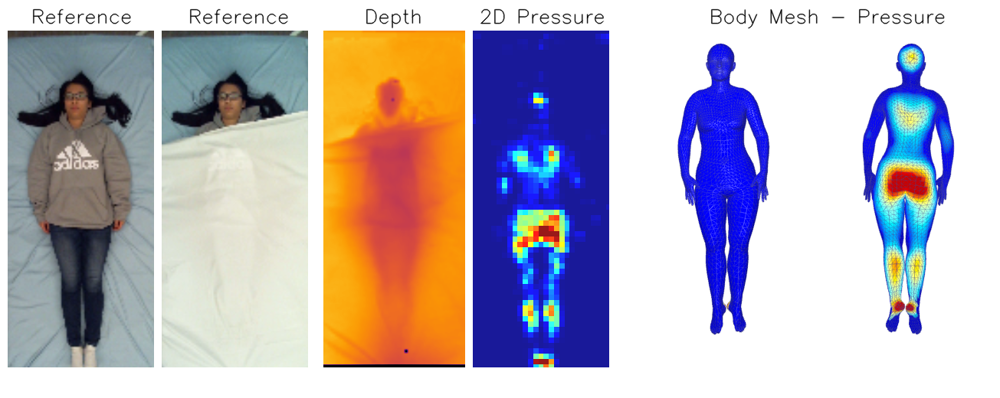

# BodyMAP

<a href="https://bodymap3d.github.io/"></a>
<a href="https://openaccess.thecvf.com/content/CVPR2024/papers/Tandon_BodyMAP_-_Jointly_Predicting_Body_Mesh_and_3D_Applied_Pressure_CVPR_2024_paper.pdf"></a>

BodyMAP leverages a depth and pressure image of a person in bed covered by blankets to jointly predict the body mesh (3D pose & shape) and a 3D pressure map of pressure distributed along the human body.

<p align="center">

</p> 

## Installation

1. Install requirements
```
pip install -r requirements.txt
```

2. Follow instructions from [shapy](https://github.com/muelea/shapy/blob/master/documentation/INSTALL.md#code) for shape metrics calculation. (For 3D shape metrics calculation)

## Data Setup 

1. Follow instructions from [BodyPressure](https://github.com/Healthcare-Robotics/BodyPressure?tab=readme-ov-file#download-data) to download and setup SLP dataset and BodyPressureSD dataset.

2. Download the SLP_SMPL_fits data from [Link](https://drive.google.com/file/d/1LiE4gjszpMsrApHuXoE5DMlMFMphpEoM/view?usp=sharing). This dataset is released for only **non-commercial purposes**, please check [license file](https://github.com/RCHI-Lab/BodyMAP/blob/main/LICENSE.txt) for details.

3. Download the 3D pressure maps for the two datasets and put in ```BodyPressure/data_BP```. ([Link](https://drive.google.com/file/d/1eLEQC2ZFWRHZ9qkyRBIFIIatwB6T_TRp/view?usp=sharing)). This dataset is released for only **non-commercial purposes**, please check [license file](https://github.com/RCHI-Lab/BodyMAP/blob/main/LICENSE.txt) for details.

4. Download SMPL human models. ([Link](https://smpl.is.tue.mpg.de/en)). Place the models (SMPL_MALE.pkl and SMPL_FEAMLE.pkl) in ```BodyMAP/smpl_models/smpl``` directory.

5. Download the parsed data (part segmented faces indexes, v2vP 1EA and v2vP 2EA indexes) and put in ```BodyPressure/data_BP```. ([Link](https://drive.google.com/file/d/19faayh5_wnssFsiDQuWqbcIX39MzMXJ7/view?usp=sharing)). This dataset is released for only **non-commercial purposes**, please check [license file](https://github.com/RCHI-Lab/BodyMAP/blob/main/LICENSE.txt) for details.

6. Change BASE_PATH constant in [constants.py](https://github.com/RCHI-Lab/BodyMAP/blob/main/PMM/constants.py#L43) based on your file structrure. The BASE_PATH folder should look like:

    ```
    BodyPressure
    ├── data_BP
    │   ├── SLP
    │   │   └── danaLab
    │   │       ├── 00001
    │   │       .
    │   │       └── 00102
    │   │   
    │   ├── slp_real_cleaned
    │   │   ├── depth_uncover_cleaned_0to102.npy
    │   │   ├── depth_cover1_cleaned_0to102.npy
    │   │   ├── depth_cover2_cleaned_0to102.npy
    │   │   ├── depth_onlyhuman_0to102.npy
    │   │   ├── O_T_slp_0to102.npy
    │   │   ├── slp_T_cam_0to102.npy
    │   │   ├── pressure_recon_Pplus_gt_0to102.npy
    │   │   └── pressure_recon_C_Pplus_gt_0to102.npy
    │   │   
    │   ├── SLP_SMPL_fits
    │   │   └── fits
    │   │       ├── p001
    │   │       .
    │   │       └── p102
    │   │   
    │   ├── synth
    │   │   ├── train_slp_lay_f_1to40_8549.p
    │   │   .
    │   │   └── train_slp_rside_m_71to80_1939.p
    │   │   
    │   ├── synth_depth
    │   │   ├── train_slp_lay_f_1to40_8549_depthims.p
    │   │   .
    │   │   └── train_slp_rside_m_71to80_1939_depthims.p
    │   │   
    │   ├── GT_BP_DATA
    |   |   ├── bp2
    |   |       ├── train_slp_lay_f_1to40_8549_gt_pmaps.npy
    |   |       ├── train_slp_lay_f_1to40_8549_gt_vertices.npy
    |   |       .
    |   |       ├── train_slp_rside_m_71to80_1939_gt_pmaps.npy
    |   |       └── train_slp_rside_m_71to80_1939_gt_vertices.npy
    │   |   └── slp2
    │   │       ├── 00001
    │   │       .
    │   │       └── 00102
    |   └── parsed
    |   |   ├── segmented_mesh_idx_faces.p
    |   |   ├── EA1.npy
    |   |   └── EA2.npy
    .
    .
    └── BodyMAP
        ├── assets
        ├── data_files
        ├── model_options
        ├── PMM
        ├── smpl
        └── smpl_models
            └── smpl 
                ├── SMPL_MALE.pkl
                ├── SMPL_FEMALE.pkl
    ```

## Model Training 

* ```cd PMM```

```
python main.py FULL_PATH_TO_MODEL_CONFIG

```

The config files for BodyMAP-PointNet and BodyMAP-Conv are provided in the model_config folder. 
The models are saved in ```PMM_exps/normal``` by default. (outside of BodyMAP directory)


## Model Training Without Supervision 

1. Train mesh regressor used for BodyMAP-WS
```
cd PMM python main.py ../model_config/WS_mesh.json
```

2. Update path of saved model weights in model_config/WS_Pressure.json file.

3. Train BodyMAP-WS: 3D pressure map regressor
```
python main.py ../model_config/WS_Pressure.json
```
The models are saved in ```PMM_exps/normal``` by default. (outside of BodyMAP directory)

## Model Testing 

1. Save model inferences on the real data 
```
cd PMM && python save_inference.py --model_path FULL_PATH_TO_MODEL_WEIGHTS --opts_path FULL_PATH_TO_MODEL_EXP_JSON --save_path FULL_PATH_TO_SAVE_INFERENCES
```
* model_path: Full path of model weights. 
* opts_path: Full path of the exp.json file created when model is trained.
* save_path: Full path of the directory to save model inferences.

2. Calculate 3D Pose, 3D Shape and 3D Pressure Map metrics. 
```
cd ../scripts && python metrics.py --files_dir FULL_PATH_OF_SAVED_RESULTS_DIR --save_path FULL_PATH_TO_SAVE_METRICS
```
* files_dir: Full path of the directory where model inferences are saved (save_path argument from step 1). 
* save_path: Full path of the directory to save metric results. The metric results are saved in a tensorboard file in this directory.

## Visualization

To visualize body mesh and 3D applied pressure map for the SLP dataset:
```
cd scripts && python plot.py --save_path FULL_PATH_TO_SAVE_VIZ --cover_type COVER_TYPE --p_idx PARTICIPANT_IDX --pose_idx POSE_IDX --viz_type image --files_dir FULL_PATH_OF_MODEL_INFEFERENCES 
```
* save_path: Full path of the directory to save visualization results. 
* cover_type: Blanket cover configuration. Default: cover1. Choices: uncover, cover1 and cover2. 
* p_idx: Participant number to visualize. Default: 81. Choices: p_idx should be between 81 and 102 (included).
* pose_idx: Pose number to visualize. Default: 1. Choices: pose_idx should be between 1 and 45 (included). 
* viz_type: Visualization Type. Default: imae. Choices: image and video.
* files_dir: Full path of the directory where model inferences are saved. When this argument is passed it plots the model inferences. Otherwise, it plots the ground truth data. 

<p center="align">
    
</p>

## Trained Models 

The trained BodyMAP-PointNet models are available for research purposes. These model weights are released for only **non-commercial purposes**, please check [license file](https://github.com/RCHI-Lab/BodyMAP/blob/main/LICENSE.txt) for details.

* BodyMAP-PointNet, trained on both depth and pressure image modalities. ([Link](https://drive.google.com/file/d/1wHNglojalqnfnMn8CXYeH8LL3DJDEwqH/view?usp=sharing))
* BodyMAP-PointNet, trained on only depth modality. ([Link](https://drive.google.com/file/d/18826WQmCfH7rhDLRwfvm_5cAqN-m7K2R/view?usp=sharing))

## Acknowledgements

We are grateful for the [BodyPressure](https://github.com/Healthcare-Robotics/BodyPressure) project from which we have borrowed specific elements of the code base.

## :white_check_mark: Cite

If you find **BodyMAP** useful for your your research and applications, please kindly cite using this BibTeX:

```
@inproceedings{tandon2024bodymap,
  title={BodyMAP-Jointly Predicting Body Mesh and 3D Applied Pressure Map for People in Bed},
  author={Tandon, Abhishek and Goyal, Anujraaj and Clever, Henry M and Erickson, Zackory},
  booktitle={Proceedings of the IEEE/CVF Conference on Computer Vision and Pattern Recognition},
  pages={2480--2489},
  year={2024}
}
```


## Authors 

* [Anujraaj Goyal](https://github.com/timbektu)
* [Abhishek Tandon](https://github.com/Tandon-A)
* [Henry Clever](https://github.com/henryclever)
* [Zackory Erickson](https://github.com/Zackory)

